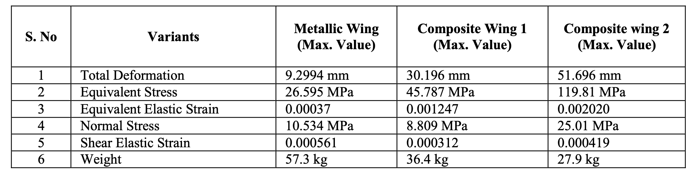

## Section 1: 相比于期中
a. 修正了stall speed
b. Range: 加了500km的margin和45min loiter
c. Takeoff Parameter: BFL
d. Matching chart 加了对比

## Section 2: Highlights
1. Above wing engine - stability; noise; wing load
2. Opt on the main wing airfoil
3. Wash out on the wing
4. Composite materials (though not shown in calculation, but is reflected in weight estimation)
    > Kirubakaran, R., Lokesharun, D., Rajkumar, S., & Anand, R. (2017). Aircraft wing weight optimization by composite material structure design configuration. IOSR Journal of Mechanical and Civil Engineering, 14(6), 71-80.
    
    > Herbeck, L., Wilmes, H. O. L. G. E. R., Kolesnikov, B., & Kleineberg, M. A. R. K. U. S. (2003). Technology and design development for a CFRP fuselage. In 25th SAMPE Europe Conference, Paris, France.
    
5. Enhanced safety: Stable at all conditions (all passengers can walk around)
    900 pass; 100 baggage: all passengers can walk around: 5% static margin at extreme
    550 pass; 450 baggage: 3 seated, any 2 walk around: 18.64% static margin at extreme
    Possible solution: baggage at front