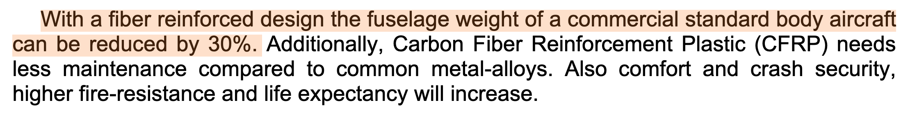

# Highlights
1. On airfoil engine
2. Opt on the main wing airfoil
3. Opt on the stabilizer airfoil
4. Wash out on the wing
5. Composite materials (though not shown in calculation, but is reflected in weight estimation)

> Kirubakaran, R., Lokesharun, D., Rajkumar, S., & Anand, R. (2017). Aircraft wing weight optimization by composite material structure design configuration. IOSR Journal of Mechanical and Civil Engineering, 14(6), 71-80.

> Herbeck, L., Wilmes, H. O. L. G. E. R., Kolesnikov, B., & Kleineberg, M. A. R. K. U. S. (2003). Technology and design development for a CFRP fuselage. In 25th SAMPE Europe Conference, Paris, France.
